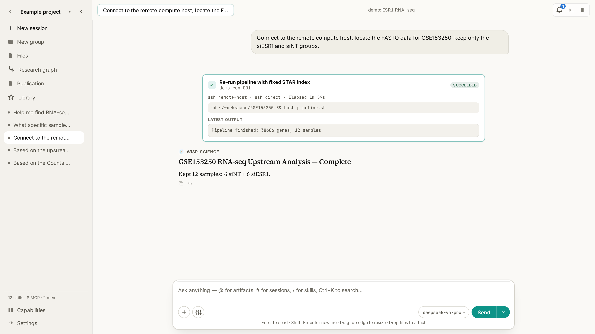

<div align="center">


# Wisp Science

**开源、本地优先的 AI 科研工作台。**

<a href="https://github.com/xuzhougeng/wisp-science/releases"></a>
<a href="https://github.com/xuzhougeng/wisp-science/releases"></a>
<a href="https://doi.org/10.5281/zenodo.21193742"></a>
<a href="https://github.com/xuzhougeng/wisp-science/blob/main/LICENSE"></a>
<a href="https://github.com/xuzhougeng/wisp-science/stargazers"></a>
<br>
<a href="https://github.com/xuzhougeng/wisp-science/releases"></a>
<a href="https://github.com/xuzhougeng/wisp-science/releases"></a>
<a href="#从源码构建"></a>

[English](README.md) · [简体中文](README_zh.md) · [文档](#文档) · [Releases](https://github.com/xuzhougeng/wisp-science/releases)



</div>

**Wisp Science** 是一个开源、本地优先的桌面 AI 科研助手和科学计算工作台。
它可连接兼容 OpenAI 或 Anthropic 的模型，在本地、WSL、SSH 和 GPU 计算环境
中运行持久化的 Python 与 R，加载可复用的 Agent Skills（`SKILL.md`），并通过
内置 Model Context Protocol（MCP）服务访问约 80 个生物信息学与计算生物学
数据库——同时把你的数据、会话和凭据留在自己的机器上。

Wisp Science 使用 Rust、Tauri v2 和 Leptos 构建，可作为跨平台桌面应用或
无界面 CLI 运行。

> **我们的宣言：** Wisp Science 开源、无国界。我们希望打造一个任何地方的
> 任何人都能使用、研究、改进和分享的科学工作台。

> **当前状态：** MVP 垂直切片。Agent 循环、流式模型提供商、工具、Python/R
> REPL、SQLite 存储、MCP 客户端和 Leptos UI 均可构建并运行。尚未完成的
> 内容见[路线图](#路线图mvp-之后)。

## WISP 是什么的缩写？

**WISP = Workspace for Intelligent Scientific Practice**
（面向智能科研实践的工作空间）

- **Workspace（工作空间）** —— 不是单个分析工具，而是完整的科研工作空间。
- **Intelligent（智能）** —— 内置 AI Agent、模型与自动化能力。
- **Scientific（科学）** —— 明确服务于科学研究。
- **Practice（实践）** —— 覆盖真实科研实践：文献检索、分析、计算、写作、
  任务管理等。

## 功能特性

**能真正干活的 Agent，而不只是聊天**

- 流式接入 OpenAI 兼容与 Anthropic 模型，按提供商管理模型配置，单一
  trait 实现分层路由。
- 在项目根目录沙箱内读写文件、搜索、执行 shell，全部经过显式审批门控；
  每个会话可选开启 **Full Permission**（开启前需确认警告）自动放行。
- 渐进式加载可复用的 Agent Skills（`SKILL.md`）——目录永远不会塞满提示词。
- 通过 ACP v1 驱动外部编码 Agent（Codex、Claude Code 等），也可以用
  [受控委派](docs/agent-delegation.md)组建可审查的子 Agent 团队。

**真实算力：从笔记本到集群**

- 每个项目都有持久化的 Python 与 R 环境——变量跨 cell、跨会话、跨重启保留。
- 本地、WSL、SSH/GPU **执行环境**，一次连接即可完成硬件与运行时探测；
  每个环境保存各自独立的解释器路径。
- 结构化 **Run** 管理长任务：提交前预检、每秒心跳、有界日志，并随环境
  快照持久化。
- 密钥只存系统密钥环，绝不写入 SQLite。不再使用自由形式的 `ssh`/`scp`，
  改为注册并探测过的主机；连接失败会打开连通性闸门，而不是静默重试。

**为科研而生**

- 通过内置 [MCP bio-tools 服务](#内置-bio-tools-mcp)访问约 80 个生物信息学
  数据库（PubMed、GEO 等），按需用 `search_mcp_tools` 发现工具，不会膨胀
  每次模型请求。
- 支持 OAuth 的远程 MCP 服务（Notion 等），以及把 Skills 与 MCP 服务打包
  分发的[功能插件](docs/feature-plugins.md)。
- 完全离线预览 Jupyter notebook、PDF、DOCX/XLSX/PPTX 和图片——图片可直接
  框选区域加入对话。
- [出版工作区](docs/publication-evidence.md)可冻结稿件修订版本，导出可验证、
  确定性的证据胶囊（Evidence Capsule）。

**会记忆的工作台**

- 会话持久化到 SQLite，重启后完整恢复；一键**撤销**某一轮对文件的修改，
  撤销前先预览将恢复或移除的文件。
- 消息下方的 **Generated** 产物只来自结构化文件写入事件；目录列表、读取、
  搜索结果或正文中仅仅提到的路径，不会被标成新生成文件。
- `@` 附加产物、文件、执行环境和语言运行时；`#` 通过只读、带引用的
  **Reader** 专员检索已保存的会话；`/` 让下一轮使用指定 skill。
- Ctrl+K / Ctrl+P 命令面板、会话文件夹、跨项目的代码与图表全局库，以及应用内
  更新检查。侧边问答会检索当前会话完整可见历史的冻结快照，并展示每次回答所依据的
  消息原文片段。
- **反馈**会立即打开空白新对话，并在用户发送第一条消息时自动附加版本、平台、
  模型与启动耗时等非敏感诊断信息；用户输入前不会调用模型。
- [加密手动同步](docs/project-sync.zh-CN.md)与一键[项目迁移](docs/project-transfer.md)
  让多台设备保持一致——绝不在后台运行。

## 快速开始

### 下载

从 [GitHub Releases](https://github.com/xuzhougeng/wisp-science/releases)
获取最新安装包：

| 平台 | 安装包 | 说明 |
|------|--------|------|
| Windows | MSI / NSIS | 安装包未签名：SmartScreen 选择 **更多信息 → 仍要运行**。若安装后窗口不出现，请先从托盘菜单 **Quit** 彻底退出，再以管理员身份运行微软官方 [WebView2 Evergreen Standalone Installer](https://developer.microsoft.com/microsoft-edge/webview2/#download-section) 修复 Runtime，然后重新打开 Wisp Science。 |
| macOS | `.dmg`（Apple Silicon + Intel） | 未签名：首次启动右键 → **打开**，或在“系统设置 → 隐私与安全性”中允许运行。 |
| Linux | — | [从源码构建](#从源码构建)。 |

### 从源码构建

前置要求：

- **Rust**（stable，1.88+）及 `wasm32-unknown-unknown`：
  `rustup target add wasm32-unknown-unknown`
- **uv**（Python 环境管理器）：<https://docs.astral.sh/uv/>
- **Trunk**：`cargo install --locked trunk` · **Tauri CLI v2**：
  `cargo install tauri-cli --version "^2"`
- 可选：PATH 中存在 **R** 的 `Rscript`，并安装 `jsonlite` 包，以使用持久化
  `r` 工具。Wisp 不会自动安装 R 包。
- Windows 需要 **WebView2 Runtime**（Windows 10/11 通常已内置，安装程序会在
  缺失时获取）。macOS 需要 **Xcode Command Line Tools**
  （`xcode-select --install`），使用系统 WebKit。

```bash
cargo tauri dev      # 热更新：Trunk 提供 UI，Tauri 打开窗口
cargo tauri build    # 在 target/release/bundle 下生成安装包（MSI/NSIS、.app/.dmg）
```

构建 Apple Silicon + Intel 通用二进制：

```bash
rustup target add x86_64-apple-darwin
cargo tauri build --target universal-apple-darwin
```

### 无界面 CLI

```powershell
$env:WISP_API_KEY = "<your provider key>"
$env:WISP_PROVIDER = "openai"           # openai（默认）、openai_responses 或 anthropic
$env:WISP_MODEL     = "deepseek-v4-pro"
cargo run -p wisp-cli                   # 终端里的交互式 Agent
```

运行单条提示词，或以 JSONL 流式输出机器可读事件（每行一个 JSON 对象），
便于脚本化：

```powershell
cargo run -p wisp-cli -- run "总结这个项目中的文件"
cargo run -p wisp-cli -- run --output jsonl "总结这个项目中的文件"
```

CLI 还内置一个小型、可重复的 Agent 回归套件（6 个固定文件任务，输出 JSON
报告，可与基线对比通过率、耗时和 Token 用量）：

```powershell
cargo run -p wisp-cli -- eval --save baseline.json
cargo run -p wisp-cli -- eval --compare baseline.json --save current.json
```

### ACP Agents（可选）

Wisp 可以启动任何已安装、通过 stdio 使用 ACP v1 的本地 Agent——这与 HTTP
模型配置相互独立：

1. 安装适配器，例如 `npm install -g @agentclientprotocol/codex-acp`。
2. 打开 **Settings → Models → ACP Agents**，设置 **Label**、**Command** 和
   **Arguments**，然后 **Save Agent** → **Test Connection**。
3. 在聊天模型选择器中选中该 Agent，发送消息即可。

完整设置步骤、Claude 示例和故障排除见
[docs/acp-agents.md](docs/acp-agents.md)。

## 配置

以下配置均为可选，项目提供了合理的默认值。桌面端把 API 密钥存入系统密钥环，
模型配置保存在 `.wisp/wisp.sqlite`（Settings → Models）；字段说明见
[模型配置](docs/model-configuration.md)。自定义凭据将名称映射到环境变量，
只注入新启动的本地 Python 与内置 MCP 进程，绝不复制到 SSH/WSL 主机。
内置凭据项会链接到各服务的官方配置页面，并说明集成用途以及未配置时 Wisp 的运行方式。

**设置 → 存储**会逐个列出项目工作区路径；选择项目后，可单独查看该工作区的
本地占用，并与应用共享数据区分开。

| 变量 | 用途 |
|------|------|
| `WISP_API_KEY` | 模型提供商 API 密钥（CLI）；桌面端改用密钥环 |
| `WISP_PROVIDER` | CLI API 提供商：`openai`（默认）、`openai_responses` 或 `anthropic` |
| `WISP_API_URL` | API 根地址；默认使用 DeepSeek / OpenAI / Anthropic |
| `WISP_MODEL` | 模型名称 |
| `WISP_MAX_CONTEXT` | 上下文预算（默认 1,000,000） |
| `WISP_MAX_ITER` | 每轮 Agent 最大迭代次数（默认 100；0 表示不限制） |
| `WISP_SKILLS_PATH` | 额外的 SKILL.md 目录，以 `;` 或 `:` 分隔 |
| `WISP_KERNEL_WORKER` | 覆盖内置 `kernel_worker.py` 路径 |
| `WISP_MCP_COMMAND` | 启动任意 stdio MCP 服务（完整命令行） |
| `WISP_MCP_PKG` | 启动内置 bio-tools 服务，例如 `mcp_pubmed` |

### 内置 bio-tools MCP

`WISP_MCP_PKG=mcp_pubmed` 会在 uv 虚拟环境中启动
`mcp-servers/bio-tools/run_server.py mcp_pubmed`。需要先在该环境中安装服务
依赖：

```bash
uv pip install mcp requests
# 以及该服务导入的专用依赖，例如 httpx、xmltodict 等
```

Agent 先用 `search_mcp_tools` 发现匹配的工具，再通过 `use_mcp_tool` 调用；
完整的服务目录不会进入每次模型请求。

### 远程 MCP（以 Notion 为例）

进入 **设置 → 连接 → 添加连接 → 远程 URL**，填写
`https://mcp.notion.com/mcp`，将认证方式设为 **OAuth**，再点击**测试**或
**保存**——两者都会在浏览器中打开 Notion 授权页。OAuth 令牌保存在系统密钥
环中，不会写入项目数据库；删除连接即清除对应凭据。

## 内置演示

`seed/` 提供五个按研究叙事排序的 ESR1 / GSE153250 示例：查找数据 → 查看样本/
数据格式 → RNA-seq 上游分析（siESR1 vs siNT counts）→ 下游 DEG/ORA/GSEA →
科学假设与研究项目设计。在桌面应用中，**Open demo** 会列出这些示例，并以只读
对话形式打开（含完整工具/run 操作记录）。示例项目不允许新建会话或发送消息，
仅用于在无需 API Key 的情况下查看 Wisp 的完整工作过程。

## 文档

| 主题 | 指南 |
|------|------|
| Case Study 选题库 | [docs/case-studies.zh-CN.md](docs/case-studies.zh-CN.md) |
| 基础配置图文教程 | [docs/basic-configuration.md](docs/basic-configuration.md) |
| 模型配置与提供商 | [docs/model-configuration.md](docs/model-configuration.md) |
| 外部编码 Agent（ACP） | [docs/acp-agents.md](docs/acp-agents.md) |
| 多 Agent 工作流 | [docs/agent-delegation.md](docs/agent-delegation.md) |
| Skills 与功能插件 | [docs/skills.md](docs/skills.md) · [docs/feature-plugins.md](docs/feature-plugins.md) |
| 终端、远程文件与传输 | [docs/terminal-sessions.md](docs/terminal-sessions.md) · [docs/remote-file-browser.md](docs/remote-file-browser.md) · [docs/server-transfers.md](docs/server-transfers.md) |
| 项目迁移与同步 | [docs/project-transfer.md](docs/project-transfer.md) · [docs/project-sync.md](docs/project-sync.md)（[中文](docs/project-sync.zh-CN.md)） |
| 出版证据胶囊 | [docs/publication-evidence.md](docs/publication-evidence.md) |
| 跨项目全局库 | [docs/global-library.md](docs/global-library.md) |
| IM 机器人（飞书 / 微信） | [docs/channels.md](docs/channels.md) |
| 真实浏览器自动化 | [docs/real-browser-automation.md](docs/real-browser-automation.md) |
| StickS3 设备桥与桌面宠物 | [docs/sticks3-device-bridge.md](docs/sticks3-device-bridge.md) · [docs/pet.md](docs/pet.md) |
| 应用更新 | [docs/app-updates.md](docs/app-updates.md) |
| UI 设计原则 | [docs/ui-design-principles.md](docs/ui-design-principles.md) |

## 开发

### 目录结构

```text
wisp-science/
├─ crates/
│  ├─ wisp-llm/     Provider trait + OpenAI 兼容 + Anthropic + SSE + RoutedProvider
│  ├─ wisp-core/    ContextManager（三层压缩）、SystemPrompt、agent_loop、memory
│  ├─ wisp-tools/   read/write/edit/search/grep/shell/attempt_completion + Windows 安全机制
│  ├─ wisp-store/   sqlx SQLite（projects/frames/messages/artifacts/settings）+ OS keyring
│  ├─ wisp-skills/  SKILL.md 发现 + search_skills/use_skill 渐进式加载
│  ├─ wisp-runtime/ 项目级 Python/R 运行时管理器 + REPL 工具
│  ├─ wisp-mcp/     stdio JSON-RPC MCP 客户端 + McpTool 适配器（内置 bio-tools）
│  ├─ wisp-acp/     外部编码 Agent 的 ACP v1 stdio 客户端
│  ├─ wisp-sync/    加密快照协议 + 可自托管的中继服务
│  └─ wisp-cli/     `wisp-science` 无界面可执行程序
├─ src-tauri/       Tauri v2 桌面壳（命令 + Agent 事件流）
├─ ui/              Leptos CSR 前端（由 Trunk 构建，在 WebView2 中加载）
├─ python/          kernel_worker.py + 模拟 MCP 服务（uv 管理）
├─ r/               可选的系统 R kernel worker（需要 jsonlite）
├─ skills/          内置 SKILL.md 目录（可复用的科研工作流）
├─ mcp-servers/     内置 MCP 服务（bio-tools：约 80 个数据库客户端）
└─ seed/            内置演示会话（ESR1 / GSE153250 ×5）
```

### 测试

- **Rust 单元测试**：`cargo test --workspace`，覆盖 `wisp-store` SQLite
  往返读写、seed 演示加载器等。
- **MCP 客户端冒烟测试**：`cargo run -p wisp-mcp --example smoke`，通过
  `uv` 启动内置模拟 MCP 服务，并完成 `tools/list` 与 `tools/call` 往返调用。
- **UI E2E（Playwright + Tauri mock）**：`ui-tests/` 在无头浏览器中运行
  Leptos UI，并使用模拟的 `window.__TAURI__`，因此不需要 Rust 后端或 API
  密钥：

  ```bash
  cd ui-tests
  npm install
  npx playwright install chromium   # 仅首次需要下载浏览器
  npx playwright test               # 启动 UI 并运行完整模拟桌面流程测试
  ```

### 架构

- **Agent 循环**（`wisp-core::agent`）：读取 → 思考 → 工具调用 → 验证；token
  流式发送到 `Output`。调用 `attempt_completion` 或模型不再返回工具调用时
  停止。
- **上下文压缩**（`wisp-core::context`）：归档优先的流水线在每次模型调用前、
  上下文达到预算 80% 时触发——先安全地裁剪工具/媒体噪音，再对净化后的原始
  历史做摘要，最终保留一个增量检查点和 8K token 的近期尾部；旧轮次不会被
  静默丢弃。
- **模型提供商**（`wisp-llm`）：一个 trait、两种 wire format（OpenAI
  `/chat/completions` 与 Anthropic `/v1/messages`），均支持 SSE 流式输出。
  `RoutedProvider` 按轮选择 low/medium/high 层级。
- **工具**（`wisp-tools`）：文件系统与 shell 工具，提供 Windows 感知的危险
  命令门控，并将沙箱限制在项目目录内。
- **Python/R REPL**（`wisp-runtime`）：每个项目、执行环境和语言各有一个由
  manager 托管的进程，可跨 cell 和会话保持命名空间；local、WSL 和 SSH 上下文
  使用同一个版本化协议。
- **MCP**（`wisp-mcp`）：最小化的 newline-JSON-RPC 客户端，可启动任意 stdio
  MCP 服务；远程 Schema 始终藏在 `search_mcp_tools` / `use_mcp_tool` 之后，
  直到任务真正需要。

## 路线图（MVP 之后）

- `FlashThinking`：按阶段注入结构化思考框架。
- `loop_engine`：在当前有界自动 Reviewer 流程之外，提供更深入的
  Implementer / Verifier / Updater 工作流。
- 产物管理，以及 UI 中的内嵌 Mol* 三维结构查看器。
- `RoutedProvider` 基于 LLM 评分选择层级（基于关键词的选择已接入）。

## 致谢

特别感谢以下社区成员的反馈、issue 报告与 PR（按报告 issue 的数量排序）：

<p>
  <a href="https://github.com/Yu-Qiao-sjtu"></a>
  <a href="https://github.com/lfz0924"></a>
  <a href="https://github.com/jarxunlai"></a>
  <a href="https://github.com/OrigamiSheep"></a>
  <a href="https://github.com/LeeJyee"></a>
  <a href="https://github.com/stardustFFF"></a>
  <a href="https://github.com/Doctorluka"></a>
  <a href="https://github.com/Charlesyu153"></a>
  <a href="https://github.com/xiaowen621"></a>
  <a href="https://github.com/liaoyuan919"></a>
  <a href="https://github.com/lhx-JIPS"></a>
  <a href="https://github.com/chenzhiyu48"></a>
  <a href="https://github.com/liuyc414"></a>
  <a href="https://github.com/kevinzzzhang76-dot"></a>
  <a href="https://github.com/Shawn-Gua"></a>
  <a href="https://github.com/Hayesss"></a>
  <a href="https://github.com/Az-Fan"></a>
  <a href="https://github.com/19951219asd"></a>
  <a href="https://github.com/yeshubiao2017-source"></a>
  <a href="https://github.com/xuxh95"></a>
  <a href="https://github.com/xiaoshen19930901"></a>
  <a href="https://github.com/scsksprings"></a>
  <a href="https://github.com/lpc520"></a>
  <a href="https://github.com/lijianchunChina"></a>
  <a href="https://github.com/kjiojio"></a>
  <a href="https://github.com/dmh-git-cop"></a>
  <a href="https://github.com/ZZRSCAR"></a>
  <a href="https://github.com/Toomi0124"></a>
  <a href="https://github.com/Lezhao0226"></a>
  <a href="https://github.com/HSsnano"></a>
  <a href="https://github.com/zwbao"></a>
  <a href="https://github.com/yuzhenpeng"></a>
  <a href="https://github.com/youxiudongdong-lang"></a>
  <a href="https://github.com/ying-ge"></a>
  <a href="https://github.com/yemiaoyong"></a>
  <a href="https://github.com/yejia1988"></a>
  <a href="https://github.com/xingzhuo123"></a>
  <a href="https://github.com/xiaochuheying19901216"></a>
  <a href="https://github.com/xiahouzuoying"></a>
  <a href="https://github.com/likemoonriver"></a>
  <a href="https://github.com/lijianguoa"></a>
  <a href="https://github.com/k1600639239"></a>
  <a href="https://github.com/gongmeiyuan"></a>
  <a href="https://github.com/chhhhai"></a>
  <a href="https://github.com/chenchen199401-cmyk"></a>
  <a href="https://github.com/btzheng"></a>
  <a href="https://github.com/Winteric123"></a>
  <a href="https://github.com/ShixiangWang"></a>
  <a href="https://github.com/ScholarlyLuck"></a>
  <a href="https://github.com/Junweichengang"></a>
  <a href="https://github.com/JarningGau"></a>
  <a href="https://github.com/Cloudy-Zhuang"></a>
  <a href="https://github.com/245429488zc-svg"></a>
  <a href="https://github.com/chewice"></a>
  <a href="https://github.com/XuuChen"></a>
</p>

- 我们最初关注过 Claude Science 一类封闭产品，但发现其对部分地区用户不友好、
  且生态封闭，因此选择独立开源实现。早期学习并借鉴了其 Skills 与 MCP 工具
  选型思路；Agent 架构、工作台功能与路线图均由开源社区自主设计与推进。
- 真实浏览器自动化受
  [GenericAgent 的 GA Web / TMWebDriver](https://github.com/lsdefine/GenericAgent)
  架构启发（MIT，Copyright 2025 lsdefine）。Wisp 的 Rust 桥接器与 Manifest V3
  扩展为独立实现；详细出处见
  [`browser-extension/NOTICE.md`](browser-extension/NOTICE.md)。
- Agent 核心基于
  [`w4n9H/mangopi-cli`](https://github.com/w4n9H/mangopi-cli)（Apache-2.0）。
- `skills/` 与 `mcp-servers/bio-tools/` 来自上游 `wisp-science` 资源包
  （Apache-2.0）。
- `skills/bear-*` 来自
  [bear-research-skills](https://github.com/fei0810/bear-research-skills)
  （CC BY-NC-SA 4.0）；在线检索需要 `scimaster-cli`。
- `kernels/kernel_worker.py` 协议改编自上游 operon kernel worker；为支持
  Windows，移除了仅适用于 POSIX 的 `resource`、`/proc` 和 `SIGINT` 机制。

## 许可证

除另有说明外，Wisp Science 采用
[GNU Affero 通用公共许可证 v3.0（仅此版本）](LICENSE)。第三方及 vendored
组件继续适用各自的许可证；上游声明保留在对应目录中，Apache License 2.0
全文保留于 [`LICENSES/Apache-2.0.txt`](LICENSES/Apache-2.0.txt)。更早发布的
版本继续适用其发布时附带的许可证。

## 引用

如果你在研究中使用 wisp-science，请引用：

[](https://doi.org/10.5281/zenodo.21193742)

```bibtex
@software{xu2026wisp,
  author    = {Xu, Zhougeng and hoptop},
  title     = {wisp-science: A local-first scientific computing agent},
  version   = {v0.33.0},
  year      = {2026},
  publisher = {Zenodo},
  doi       = {10.5281/zenodo.21193742},
  url       = {https://doi.org/10.5281/zenodo.21193742}
}
```

## Star History

<a href="https://star-history.com/#xuzhougeng/wisp-science&Date">
  
</a>
