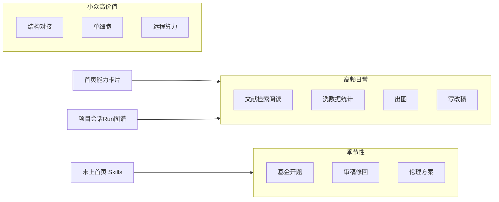

# 医疗科研视角：天成科研助手能力审阅报告

- **日期**：2026-08-16
- **版本**：对照当前桌面产品（能力首页 + bundled skills + bio-tools MCP）
- **评审立场**：医院临床 / 转化医学科研人员（队列、病例对照、RCT 次级分析、部分湿实验与生信）。日常在中英文献、Excel/HIS 导出表、统计出图、中文基金/伦理、SCI 投稿之间切换。不是纯计算生物学家，也不是只写 Nature 长文的专职写手。
- **评审范围**：首页 7 组能力卡片（约 50 张）+ 未上首页的 bundled skills（约 80+）+ 平台底座（项目 / 会话 / Run / 图谱 / MCP / 专家）。
- **依据**：[ui/src/capabilities_home.rs](../ui/src/capabilities_home.rs)、[docs/天成科研助手-完整功能思维导图.md](../docs/天成科研助手-完整功能思维导图.md)、[skills/](../skills/)、[mcp-servers/bio-tools/lib/mcp_bio/domains.json](../mcp-servers/bio-tools/lib/mcp_bio/domains.json)。
- **配套 backlog**：[docs/superpowers/plans/2026-08-16-medical-p0-backlog.md](../docs/superpowers/plans/2026-08-16-medical-p0-backlog.md)

## 一句话

当前产品对「英文学术写作 + 计算生物学工作台」很厚；对「中国医院科研人员一周真实活」（知网、Zotero、样本量、CONSORT/STROBE、生存分析、国自然栏目、伦理/知情同意、个人文献库问答）偏薄。底座（本地优先、持久 Python/R、PII、出版证据）是对的，缺的是临床科研工作流的第一公民入口。

## 排名口径

`实用分 = 使用频率 × 任务阻塞度 × 当前可完成度`

- **频率**：日 / 周 / 季 / 偶发
- **阻塞度**：不做就卡住下一环节
- **可完成度**：能直接交付 vs 只是引导对话 vs 占位卡片

分数为相对序，不是绝对值。

---

## 1. 能力全景

### 1.1 首页七组（用户能点到的）

- **论文撰写**：academic-paper / pipeline / reviewer、deep-research、nature-writing / polishing / citation / response / reviewer / data / ref-verifier / proposal / paper-to-patent、humanizer-zh、OfficeCLI
- **AI 画图**：nature-figure、R 生信图、paper2ppt、PPT Master、AI 插图；**三张占位未接线**：AI机制图、图片可编辑、生信图布局
- **数据清洗**：数据清洗专家、出站隐私脱敏、本机环境配置
- **统计分析**：nature-statistics（期刊统计表述审核，不是算统计）、知识图谱、统计建模引导、Python/R 持久分析、生物数据库、远程算力
- **结构与组学**：结构预测、单细胞（入口粗，细节在隐藏 skill）
- **研究资产**：多源检索、文献流水线、合法全文、论文卡片、中英对照阅读、实验日志、研究图谱、出版证据、文件库、演示
- **协作扩展**：通用 Agent、多 Agent/Workflow、飞书微信、真实浏览器、Playwright、插件

### 1.2 已装但首页几乎看不见（对医疗科研很关键）

- 证据治理：`literature-review`、`bear-*`（概念地图 / 正反证据 / 选题撞车）、`pdf-explore`、`journal-club-ppt`、`audit-biomedical-paper-evidence`、`figure-duplicate-audit`、`indication-dossier`
- 组学 / 结构：AF2 / OpenFold3 / Boltz / DiffDock / MPNN / scvi / scGPT
- **bio-tools MCP 已有 `clinical-trials`、`pubmed`、`drug-regulatory`、`clinical-genomics`、`human-genetics`**，但首页只露出「生物数据库」一张粗卡片

---

## 2. 实用性总排名（医疗科研视角）

按「我一周会不会反复用」排序。

### S 级：几乎每周都用，缺了会换工具

| 序 | 能力 | 频率 | 现状 | 医疗场景评价 |
|---|---|---|---|---|
| 1 | 多源文献检索 + PubMed MCP | 日 | 强，但中文源弱 | 查机制、找对照、写引言的第一入口 |
| 2 | PDF 深读 / 论文卡片 / 中英对照 | 日 | 强（nature-reader/card + pdf-explore） | 组会前读 2–5 篇是刚需 |
| 3 | 数据清洗专家 | 周 | 强（专用 specialist） | HIS/Excel 导出表几乎每项研究都要洗 |
| 4 | Python/R 持久分析 + 统计建模 | 周 | 中强：能算，缺临床设计向导 | 真正「出 p 值和表」靠这个，不是 nature-statistics |
| 5 | R 生信图 / 投稿级作图 | 周 | 强 | KM、森林、ROC、热图是临床稿标配 |
| 6 | Nature 润色 / 起草 / 去 AI 味 | 周 | 很强 | SCI 投稿周频；中文稿也常用 humanizer |
| 7 | 出站隐私脱敏 | 日（开着） | 已有，覆盖面偏窄 | 临床表一粘贴就有手机号/住院号；目前主要邮箱电话身份证 |

### A 级：项目关键节点必用

| 序 | 能力 | 频率 | 现状 | 评价 |
|---|---|---|---|---|
| 8 | 参考文献核验 + 引用补全 | 投稿前 | 强 | 假文献是医疗稿最大翻车点 |
| 9 | 修回信 / 模拟审稿 | 季 | 强 | 一次修回省数天 |
| 10 | 基金/开题写作 | 季 | 有通用 pipeline，缺国自然栏目 | 医院里季节性最高价值 |
| 11 | 论文转组会 PPT / Office | 周–月 | 强 | 科主任最爱看的交付物 |
| 12 | 合法全文获取 | 周 | 中：OA/机构；知网靠浏览器 | 中文综述离不开知网 |
| 13 | 实验日志 | 日（湿实验组） | 有 | 临床转化实验室有用，纯临床队列用得少 |
| 14 | 出版证据工作区 | 投稿前 | 强且独特 | 防止「图和正文对不上」 |
| 15 | 生物数据库（GEO/UniProt/PDB） | 周（转化组） | MCP 已有 | 机制/组学课题高频 |

### B 级：有用但不是每天打开

| 序 | 能力 | 频率 | 现状 | 评价 |
|---|---|---|---|---|
| 16 | 深度调研 / 文献流水线 / bear-* | 开题/综述时 | 强但入口散 | 应合成「选题—综述」一条线 |
| 17 | 研究图谱 / 文件库 / 项目记忆 | 持续 | 底座好 | 长期项目才显价值 |
| 18 | 知识图谱（文本抽三元组） | 偶 | 已做交互可视化 | 好看，替代不了读论文 |
| 19 | 数据可用性 / FAIR | 投稿时 | 有 | GEO/Dryad 声明用得上 |
| 20 | 多 Agent / Workflow | 复杂任务 | 有 | 圆桌审稿有价值，日常过重 |
| 21 | 远程算力 / 环境配置 | 组学/结构 | 有 | 临床队列很少用 SSH |
| 22 | 单细胞 / 结构预测 | 专项 | skill 全，首页粗 | 计算组 S 级，临床组 C 级 |
| 23 | 适应症档案 indication-dossier | 转化/药企合作 | 隐藏 | 做新适应症时很强 |
| 24 | 论文转专利 | 偶 | 有 | 医院成果转化季有用 |

### C 级：锦上添花或占位

| 序 | 能力 | 评价 |
|---|---|---|
| 25 | AI 插图 / 机制图占位 | 概念图有需求，但投稿图必须数据驱动；三张占位不要继续堆 |
| 26 | 飞书/微信接入 | 在实验室外追进度方便，不是科研核心 |
| 27 | 真实浏览器 / Playwright | 知网/投稿系统登录时有用，日常不应当主入口 |
| 28 | 插件 / 演示 / 宠物 | 获客与扩展，不进科研排名 |

---

## 3. 对医疗科研「高频但未做透」的已有能力

这些不是从零缺失，而是**有底座、缺临床产品化**：

1. **统计是「审核写法」不是「做分析」**：`nature-statistics` 管 p 值表述；真正 KM/Cox/logistic/倾向评分要靠通用 Python/R 引导。临床医生需要「选设计 → 算样本量 → 出 Table 1 → 出生存/回归」的专用专家。
2. **临床试验 MCP 已在 bio-tools 里**（`search_trials` / `get_trial_details`），首页没有「查 ClinicalTrials / 中国 ChiCTR」卡片。
3. **文献技能重复且入口散**：nature-academic-search、literature-pipeline、deep-research、literature-review、bear-* 五套，用户不知道开哪张。
4. **PII 不是 PHI**：住院号、病案号、检查号、中文姓名+日期组合、影像 DICOM 未覆盖。
5. **三张 AI 画图占位**降低信任：点了没反应，比没有更伤。

---

## 4. 系统缺少的能力 + GitHub 开源

按「中国医院科研人员会不会因此留下/离开」排序。星标为 2026-08-16 调研时的公开数据，会变。

### P0：不做就会被 Zotero + SPSS + 知网组合替代

#### 1. 个人文献库问答（Zotero / 本地 PDF RAG）

- **场景**：对着自己下过的 200 篇 PDF 问「这套方案的纳入标准怎么写的」
- **现状**：能读单篇 PDF，不能检索整个库
- **开源**：
  - [Future-House/paper-qa](https://github.com/Future-House/paper-qa)（PaperQA2，约 9k★，Apache-2.0）— 科学文献 RAG 标杆，已支持 ClinicalTrials.gov 工具
  - [54yyyu/zotero-mcp](https://github.com/54yyyu/zotero-mcp)（约 4.4k★）— 读 Zotero 元数据 / 标注
  - [qiobn/zotero-research-assistant](https://github.com/qiobn/zotero-research-assistant) — 本地 RAG + 可选知网，适合中英双语库
- **接入**：优先 MCP 插件，不要重写 RAG 引擎

#### 2. 中文文献第一公民（知网 / 万方，而不是「用浏览器凑」）

- **场景**：中文综述、国自然立项依据、中华系列投稿
- **现状**：`nature-downloader` 提到知网，无结构化检索 / 题录 / 核心期刊标记
- **开源**：
  - [Qianxi-GXMU/cnki-skills](https://github.com/Qianxi-GXMU/cnki-skills)（及同源 fork）— 检索 / 期刊索引 / 下载 / 导出 Zotero，走 Chrome DevTools
  - 同上 zotero-research-assistant 的 `search_cnki_literature`
- **注意**：知网无稳定官方 API，只能「复用用户登录态的浏览器桥」；产品已有真实浏览器，应做成正式 skill，而不是让用户自己点浏览器卡片

#### 3. 临床统计与研究设计专家（样本量 / Table 1 / 生存 / 诊断试验）

- **场景**：伦理送审要样本量依据；稿件要 Table 1、KM、Cox、ROC、logistic
- **现状**：通用 REPL + 期刊统计审核，没有设计向导
- **开源**：
  - [DoyoungJang/medsci-skills](https://github.com/DoyoungJang/medsci-skills) — 医生写的 22 个 skill：`calc-sample-size`（11 种设计）、`analyze-stats`（生存 / 倾向评分 / 诊断试验）、`design-study`、`check-reporting`；星标少但场景最贴
  - [LucyMcGowan/survivalpwr](https://github.com/LucyMcGowan/survivalpwr)、[vubiostat/ps](https://github.com/vubiostat/ps) — 样本量计算
- **接入**：新 specialist「临床统计专家」+ 复用持久 R（survival / tableone / pROC / MatchIt）

#### 4. 系统综述 / 荟萃分析流水线（PRISMA + 森林图）

- **场景**：临床科室最高产的论文类型之一；现有 deep-research **不是** PRISMA
- **开源（成熟度分层）**：
  - 筛查：[asreview/asreview](https://github.com/asreview/asreview)（约 943★，Apache-2.0，Nature MI 论文）— 人机协同标题摘要筛查，最值得集成
  - 统计出图：R `metafor` / `meta`（CRAN，不必自研）
  - Agent 流水线（新、需谨慎评估质量）：[sensein/synthscholar](https://github.com/sensein/synthscholar)、[SciSpark-ai/meta_analyst](https://github.com/SciSpark-ai/meta_analyst)、[Vambrocop/EvidenceForge](https://github.com/Vambrocop/EvidenceForge)、[O0000-code/meta-analysis-skill](https://github.com/O0000-code/meta-analysis-skill)
- **产品原则**：筛查与统计必须可审计、人签字；不要全自动「生成一篇 meta」

### P1：临床研究合规与投稿规范

#### 5. 报告规范清单 + 流程图（CONSORT / STROBE / STARD / PRISMA / CARE）

- **开源**：[htlin222/flowdoc](https://github.com/htlin222/flowdoc)（YAML→SVG 流程图）、[adayim/consort](https://github.com/adayim/consort)（CRAN）、[tiagojct/quarto-study-flow](https://github.com/tiagojct/quarto-study-flow)、medsci-skills 的 `check-reporting`
- 与现有 `nature-figure` / 出版证据胶囊天然互补

#### 6. 临床试验注册检索产品化

- CT.gov 已有 MCP，缺 ChiCTR 中文与 PICO 卡片
- **开源 MCP**：[wjddusrb03/clinical-research-mcp](https://github.com/wjddusrb03/clinical-research-mcp)、[pubspro/pharma-mcp](https://github.com/pubspro/pharma-mcp)（还含 FDA/FAERS/ICH）、[Tianyu-Qu/mcp-pubmed-evidence](https://github.com/Tianyu-Qu/mcp-pubmed-evidence)
- **建议**：先把已有 `clinical-trials` domain 做成首页卡片，再补 ChiCTR（大概率要浏览器）

#### 7. 国自然 / 医院基金栏目，而不是通用 proposal

- **现状**：`nature-proposal-writer` 是证据先行的通用开题，不是 NSFC 2026 栏目与限项
- **开源**：
  - [njzjz/nsfc-agent-skills](https://github.com/njzjz/nsfc-agent-skills) — 写作 / 图 / 文献 / 2026 政策速查
  - [viplee110/nsfc-writer](https://github.com/viplee110/nsfc-writer) — 文件夹工作台，强调申请人核实
  - [jiankang1991/nsfc-benzi-audit](https://github.com/jiankang1991/nsfc-benzi-audit) — 本子诊断，含医学伦理链条检查
  - [Lin-zhijie/grant-master](https://github.com/Lin-zhijie/grant-master) — 可审计中文申请书流水线
- **接入**：在现有 proposal skill 上加「NSFC 栏目模板 + 政策速查」，不要再做一套生成器

#### 8. 临床 PHI 去标识（比 PII 防火墙更深）

- **开源**：medsci-skills `deidentify`（含 cn locale）、[microsoft/presidio](https://github.com/microsoft/presidio)、[supritkumar007/phi-deid-pipeline](https://github.com/supritkumar007/phi-deid-pipeline)、影像 [Australian-Imaging-Service/phi-finder](https://github.com/Australian-Imaging-Service/phi-finder)
- **建议**：扩展现有防火墙，增加病案号 / 住院号 / 中文姓名+日期，默认「分析前先脱敏」

### P2：有了会明显加分，可后做

| 缺口 | 场景 | 开源线索 |
|---|---|---|
| 期刊匹配（中华系列 + SCI） | 被拒后改投 | medsci-skills `find-journal`；Jane（BIOSIS，非 GitHub） |
| 伦理 / 知情同意 / 方案骨架 | 伦理委员会材料 | medsci-skills `write-protocol`；无高质量中国伦理开源，宜自建模板（卫健委 / 机构范本） |
| 指南检索（NCCN/CSCO/UpToDate 替代） | 临床背景段 | 无合法全文开源；只能做公开指南目录 + 用户自备 PDF |
| 湿实验量化（qPCR ΔΔCt、WB 条带、流式门控） | 转化实验室周频 | 成熟独立软件多（ImageJ/FlowJo），Agent skill 稀缺；宜接 ImageJ/Python 脚本而非新 GUI |
| 医学影像 / DICOM | 放射 / 病理科研 | 生态大（OHIF、MONAI），与当前桌面工作台耦合重，建议插件而非内核 |
| REDCap / eCRF / CDISC | 正式临床试验 | REDCap 有 API；医院落地难，适合研究型医院插件 |
| 中文核心期刊格式（中华医学会系列） | 国内投稿 | 无统一开源；可仿 nature-shared 做 journal-formats |

---

## 5. 和竞品 / 开源工作台的位置

- **Stanford Biomni**（[snap-stanford/biomni](https://github.com/snap-stanford/biomni)，约 3.6k★）：工具海洋，适合演示 CRISPR / 单细胞；天成已有类似 bio-tools，不必追数量。
- **PaperQA2 / Robin（FutureHouse）**：文献闭环更强；天成应用本地项目 + 证据胶囊差异化，补 Zotero/RAG 即可对齐「问自己的库」。
- **medsci-skills**：最像「医院科研人员清单」，22 个 skill 几乎逐条打在天成缺口上，值得作为 P0 对标而不是再发明分类。

---

## 6. 产品建议

### 立刻（体验债）

- 拿掉或标明三张未接线画图卡片
- 首页增加：临床试验检索、临床统计、我的文献库（即使先跳转设置装 MCP）
- 把 `pdf-explore` / `audit-biomedical-paper-evidence` / `literature-review` 从隐藏变成「研究资产」正卡

### 下一季（医疗差异化）

- 临床统计专家 + 样本量 + Table 1 / 生存 / ROC
- Zotero MCP + 本地 PDF RAG
- 知网 skill（复用已有浏览器桥）
- PRISMA 筛查（ASReview）+ metafor 出图，人签字门
- PII → PHI（病案号 / 中文姓名）
- NSFC 栏目层叠在现有 proposal 上

### 不要优先

- 再堆结构预测模型
- 再做一套通用 deep-research
- 宠物 / IM
- 全自动「一键 meta 成稿」

P0 拆分与验收见配套 backlog。

---

## 7. 架构气味（与本次审阅直接相关）

能力发现层和真实技能库存已经分叉：首页约 50 卡，bundled skill 80+，还有 MCP domain 未产品化。这是**晦涩**（用户找不到临床试验 / 审证据）加**冗余**（五套文献入口）。

建议只维护「场景 → 一条主 skill + 若干被调用子 skill」，而不是继续加平行卡片。首页入口收敛的具体改法写在 P0 backlog 的「首页入口收敛」一节。

---

## 参考链接

- 能力目录：[ui/src/capabilities_home.rs](../ui/src/capabilities_home.rs)
- 功能导图：[docs/天成科研助手-完整功能思维导图.md](../docs/天成科研助手-完整功能思维导图.md)
- bio-tools 域：[mcp-servers/bio-tools/lib/mcp_bio/domains.json](../mcp-servers/bio-tools/lib/mcp_bio/domains.json)
- P0 改动清单：[docs/superpowers/plans/2026-08-16-medical-p0-backlog.md](../docs/superpowers/plans/2026-08-16-medical-p0-backlog.md)
